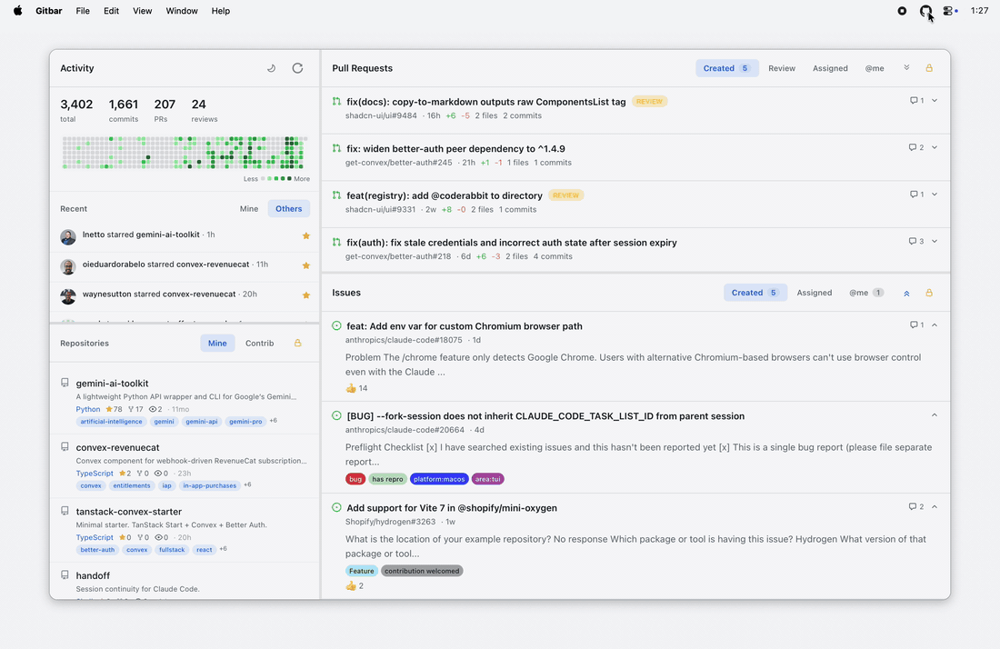

# Gitbar



I kept bouncing between GitHub tabs for PRs, issues, and activity. Wanted one menubar window for all of it. So I built this.

Menubar GitHub dashboard built with Tauri.

## Layout

2-panel layout with resizable sections:

- **Left**: stats, contribution calendar, activity feed (mine/others), repositories (mine/contributed), split into two resizable panes
- **Right**: PR list and issue list in resizable panes. Click in for detail view with full markdown body, comments, reviews.

PRs show diff stats, reviewers, approval status, branch info. Issues show reactions, linked branches, task progress. Repos show stars, forks, language, topics, visibility.

Privacy toggle (lock icon) hides private repos, PRs, and issues across all panels. Useful for screenshots and livestreams.

Light/dark theme, persisted to localStorage.

## Performance

3 parallel GraphQL queries + REST events, not one blocking call:

1. **Viewer**: repos, stats, calendar
2. **PR searches**: created, review requested, assigned, mentioned
3. **Issue searches**: created, assigned, mentioned

Progressive rendering: viewer data renders as soon as it arrives. PR/issue data fills in when searches complete. Activity loads last in the background.

- Stale-while-revalidate: cached data renders instantly, fresh data loads behind the scenes
- localStorage persistence: survives app restarts, instant cold start
- 30-minute cache TTL: subsequent opens within window are instant (no network)
- Username persisted: events query fires in parallel on first load instead of waiting for viewer response
- IntersectionObserver: only visible items rendered, more load on scroll

## Stack

- Tauri v2 (native wrapper, ~5MB binary)
- React 19
- Vite 7
- Tailwind v4
- shadcn/ui (scroll area, avatar, badge, button)
- `react-resizable-panels`

## Prerequisites

- [Bun](https://bun.sh)
- [Rust](https://rustup.rs) (required by Tauri)
- [gh CLI](https://cli.github.com) authenticated (`gh auth login`)

## Setup

```bash
bun install              # install deps
bun run tauri dev        # dev mode
bun run tauri build      # build
```

Uses `gh auth token` to get a token at runtime. No env vars needed.

## License

MIT
